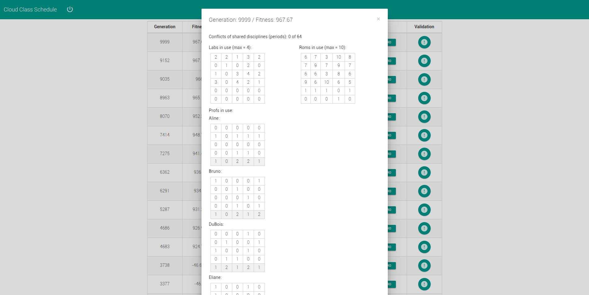

# Cloud Class Schedule

## Grupo/Integrantes

* Daniel Farias (<drfarias@inf.ufpel.edu.br>)
* Luan Einhardt (<ldseinhardt@inf.ufpel.edu.br>)
* Lúcio Leal (<llbastos@inf.ufpel.edu.br>)
* Pablo Kila (<ptkila@inf.ufpel.edu.br>)

#### Plataforma

[Node.js](https://nodejs.org)

#### Bibliotecas utilizadas

#### [express](https://github.com/strongloop/express)

Provê para a aplicação rotas para o cliente (site).

#### [socket.io](https://github.com/socketio/socket.io)

Provê para a aplicação uma comunicação (socket) cliente-servidor a partir de requisições http.

#### [d3](https://github.com/mbostock/d3)

Provê para a aplicação um parser csv.

#### [genetic-js](https://github.com/subprotocol/genetic-js)

Provê para aplicação uma interface para um algoritmo genético, onde deve ser definido as funções que criam um individuo, mutação, cálculo de fitness e tudo mais.

###### Como instalar bibliotecas

[npm](https://www.npmjs.com) é um gerenciador de pacotes javascript que irá instalar todas as dependências necessárias.

```
$ ./install
```
ou
```
$ npm install
```


#### Como executar

```
$ ./run
```
ou
```
$ ./server.js
```
ou
```
$ node server.js
```

##### Notas

* Utilizar uma versão recente do node (>= v4.2.3).
* Cliente testado com Google Chrome v47.


## Documentação

### Plataforma

Escolheu-se como plataforma desenvolver a aplicação em javascript com node.js pela facilidade em modelar o problema, prover uma interface agradável ao usuário e pelo fato de haver bibliotecas que agilizam o desenvolvimento.

### Cloud

Tanto o desenvolvimento quanto os testes foram realizados no [Cloud9](https://c9.io), embora este não seja um ambiente de produção e sim de desenvolvimento, verificou-se como a aplicação se comportaria em uma cloud. Além disso, o fato de aplicação ser desenvolvida em node.js permite que a aplicação seja executada em qualquer ambiente que tenha o mesmo instalado, seja ele um ambiente com linux ou não.

### Modelagem do problema

O problema foi modelado da seguinte forma:

Primeiramente é realizado um parser dos arquivos CSV e caso a disciplina seja ofertada, bem como o professor não esteja em licença é inserido as informações dos mesmos em 2 listas separadas. Logo após esta etapa é verificado se a carga horária de disciplinas e professores está de acordo, se estiver será realizado os próximos passos, senão é informado ao usuário.

Posteriormente a leitura dos dados é realizado a combinação de disciplinas e professores, portanto cada execução pode gerar uma combinação diferente dado a carecterística aleatória do algoritmo, onde este ordena os semestres de modo decrescente para priorizar as preferências por disciplinas mais avançadas, verificando para cada diciplina se há um professor que tenha interesse pela mesma e que ainda tenha carga horária livre, se houver mais de um é escolhido este aleatoriamente entre estes, se não houver nenhum é escolhido entre todos os professores que possuam carga horária livre, priorizando ainda aqueles que não possuam preferências.

Os próximos passos são dados pelo algoritmo genético, onde é implementados os seguintes métodos:

##### Criação de individuos

Os indivíduos são uma solução completa de uma grade de horários, seja essa boa ou não e sua criação é dada pela inserção da combinação de disciplina e professor, bem como outras informações relevantes de forma aleatória, onde sorteia-se um horário na grade e se este estiver livre é inserido, caso contrário é inserido no primeiro horário disponível. Além disso após testes com uma modelagem um pouco diferenciada, optou-se por inserir a disciplina compartilhada no mesmo horário, então dessa forma a disciplina caso compartilhada só é inserida no horário se estiver livre em ambos os cursos, garantido dessa forma não haver o problema de disciplinas compartilhadas não estarem ocorrendo ao mesmo tempo.

Pra resolver a questão de turmas extras para disciplinas poderem ocorrer ao mesmo tempo que a primeira turma, optou-se por criar um novo semestre, dados este pelo nome do semestre + '_1', assim como ocorre normalmente.

##### Cruzamento

Operação pela qual pega-se duas grades de horários (denominados pai e mãe) e cria-se duas novas grades de horários (denominados filho e filha), onde é realizado para ambos uma combinação de horários do pai e da mãe.

Mais detalhadamente, percorre-se a grade de horário da mãe e para cada horário que contém uma disciplina é verificado a probabilidade da mesma ser inserida em uma lista de horários para a filha, sendo esta probabilidade de 50% para sim e 50% para não, também é realizado a mesma operação para a lista de disciplinas do filho. Posteriormente percorre-se a grade de horários do pai e insere-se as disciplinas que ainda faltam, sendo que na filha são inseridas no fim da lista e no filho no topo da lista, dessa forma é priorizado no filho os horários do pai, enquanto que na filha os horários da mãe. Em caso de conflito insere-se aleatoriamente.

Além disso a propriedade de disciplinas compartilhadas terem de occorer no mesmo horário é verificada e cumprida.

##### Mutação

Operação pela qual pega-se uma grade de horários e tenta-se através de 2 horários sorteados troca-los de lugar. Os horários sorteados podem conter:

1. Nenhuma disciplina, onde nada ocorre.
2. Uma disciplina e um horário vago, onde é realizado a troca de horário da disciplina.
3. Duas disciplinas, onde é realizado a troca de horáris de ambas.

Além disso caso alguma disciplina sejá compartilhada é realizada a troca somente se possível realizar a troca da disciplina no outro curso também.

##### Cálculo de fitness

Com o cálculo do fitness, busca-se otimizar as seguintes propriedades:

1. Um professor não pode ministrar duas ou mais aulas ao mesmo tempo (__Obrigatória__).
2. Não deve ser utilizado mais laboratórios que o disponível (__Obrigatória__).
3. Deve-se utilizar o mínimo de salas possível (__Opcional__).
4. Professores devem dar o mínimo de aulas em um dia (__Opcional__).

O cálculo de fitness pode resultar valores positivos e negativos, sendo que se negativo as propriedades obrigatórias não estão sendo cumpridas e se positivo as regras opcionais estão sendo otimizadas e o horário é então minimamente aceitável.

Além disso, o algoritmo genético neste caso busca maximizar a solução, sendo então que quanto maior o valor de fitness melhor.

##### Notificação

Verifica se houve um ganho de fitness (houve um progresso na solução), em em caso positivo envia ao cliente informações da solução (grade de horários), bem como métricas que possibilitam avaliar a solução.

### Interface

Como pode ser visto na figura abaixo a interface de entrada da aplicação é simples com um botão que permite realizar as configurações e iniciar a aplicação.


Como pode ser visto na figura abaixo ao clicar no botão de iniciar, abre-se um popup onde é possível realizar configurações de entrada para a aplicação, sendo estes descritos a seguir:

Configurações do problema:
* Arquivo de disicplinas (CSV)
* Arquivo de professores (CSV)
* Número máximo de laboratórios disponíveis
* Períodos permitidos para gerar a grade de horários

Configurações do algoritmo genético:
* Número de gerações
* Tamanho de população
* Probabilidade de haver um cruzamento
* Probabilidade de haver uma mutação


Como pode ser visto na figura abaixo os resultados são exibidos em uma tabela conforme ha um ganho de fitness, sendo que é apresentado a geração em que se encontra, o valor de fitness, os botões para exibir a grade de horários de cada curso e por fim um botão que permite visualizar rapidamente o que está bom ou não na solução.


Como pode ser visto na figura abaixo ao clicar no botão do curso de alguma solução abre-se um popup com a grade de horários, onde é possível navegar pelos semestres e visualizar os mesmos. Em casa horário é informado o nome da disciplina, a turma se estiver definido, o professor caso não seja uma disciplina fixa de outro departamento e por fim a sala, onde esta pode ser uma sala normal ou um laboratório.


Como pode ser visto na figura abaixo ao clicar no botão de validação, ao lado de uma solução, abre se um popup informando algumas métricas que possibilitam verificar rapidamente o quanto uma solução pode ser boa.



Como podemos ser visto na figura abaixo está foi a configuração utilizada para obter os resultados anteriores.


### Resultados

Obteve-se resultados bons e ótimos utilizando-se uma configuração para o algoritmo genético com uma população de 5 individuos, uma probabilidade de crossover e mutação de 0.5.

Resultados relativamentes bons são gerados em alguns poucos minutos com 10.000 interações e ótimos  com cerca de 100.000 interações. Utilizando-se de uma população de 5 individuos o algoritmo mostrou processar 10 interações por segundo.

### Conclusões finais

O algoritmo genético se mostrou funcional para o problema, embora talvez não seja a melhor opção.

#### O que ainda pode ser melhorado no trabalho?

1. Requisito de disciplinas que não são requisitos não ocorrerem ao mesmo tempo.
2. Exportação de resultados, seja como CSV ou PDF.
3. Otimizações de performace e melhorias na interface para o usuário.
4. Refatoração de código e documentação melhor.
5. Implementação de demais requisitos que possam vir a ser solicitados.
